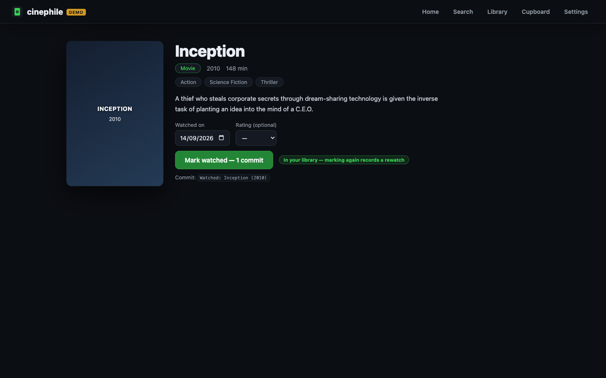
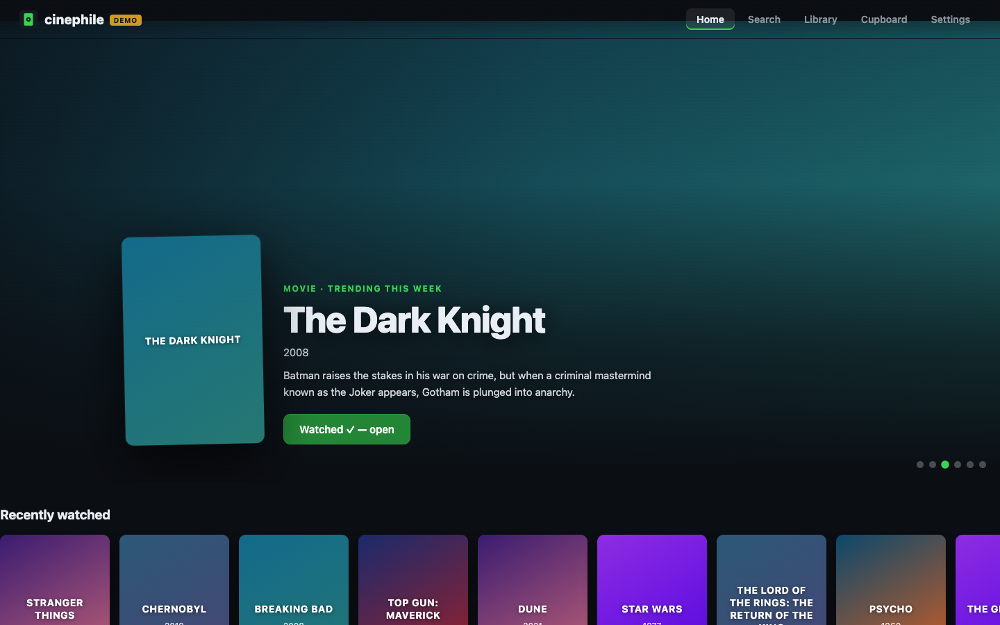
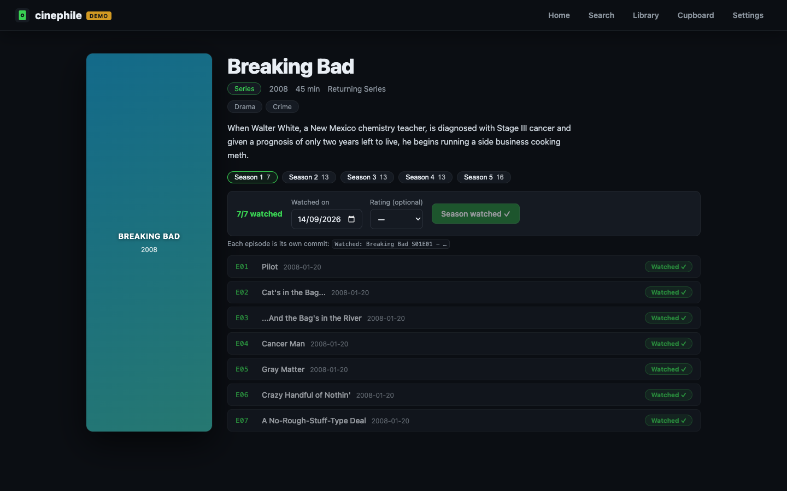

# cinephile

**A local, open-source watch tracker for movie lovers — every movie or episode you watch becomes a commit on your GitHub profile.**

Developers get satisfying green contribution squares for writing code. Cinephiles who watch films and episodes every single day deserve the same reward. Mark a movie watched → exactly one commit. Binge a 10-episode season → exactly 10 commits, one per episode. Your GitHub profile turns into a watch diary, and your collection becomes a wall of blu-ray cases in your own Criterion-style closet.



| Cinematic home | Series detail with season fan-out |
| --- | --- |
|  |  |

## How it works

1. **Find it** — browse the cinematic home feed (live TMDB trending rows) or search millions of movies and series.
2. **Mark it watched** — cinephile appends one line to `watched.jsonl` in *your* GitHub repo and creates exactly one commit on the target branch:
   - Movie → `Watched: Inception (2010)` — 1 commit
   - Episode → `Watched: Breaking Bad S01E04 - Cancer Man` — 1 commit per episode, always
   - Whole season → N commits in episode order, **never squashed**. Bingeing *is* the point.
3. **Shelf it** — the Closet page is a Criterion-Closet-inspired 3D room: warm wood shelving floor to ceiling, your collection packed spine-out like a wall of Criterion discs (spines colored from each film's artwork, numbered in watch order), with occasional face-out covers. Hover to pull a spine toward you; click to take the case off the shelf and read it. The closet grows as your collection does.

Your repo is the **source of truth**: the app keeps no database. On startup it reads `watched.jsonl` back from the repo, so your library follows you anywhere the repo goes, and every entry is plain, diff-able JSON:

```jsonl
{"tmdb_id":27205,"type":"movie","title":"Inception","year":2010,"watched_at":"2026-09-01T20:00:00.000Z","rating":9,"poster_path":"/edv5CZvWj..."}
{"tmdb_id":1396,"type":"tv","title":"Breaking Bad","year":2008,"watched_at":"2026-09-02T21:00:00.000Z","season":1,"episode":4,"episode_title":"Cancer Man","rating":10,"poster_path":"/ggFHV..."}
```

Watch dates default to *now*; pick a past date and the commit is authored with that date, backfilling the corresponding contribution square.

## Architecture

Three moving parts, deliberately separated:

- **Server** (`server/`, Express + TypeScript) — the only component that touches credentials. It holds your GitHub token and TMDB key in a local gitignored `config.json`, validates them live (GitHub whoami + push access + branch existence, TMDB ping), performs every GitHub commit through the Git data API, and proxies TMDB searches so the key never reaches the browser.
- **Client** (`src/`, React + Vite) — pure UI: home feed, search, detail pages, library, the 3D closet (react-three-fiber). It only ever talks to the local server over `/api`.
- **The target repo** — the source of truth. `watched.jsonl` (one JSON line per watch) on the branch you configure is the entire database; the app derives all state from it on startup and after every watch.

No accounts, no telemetry, no server-side storage beyond your own GitHub repo.

## Quickstart

Requirements: Node.js ≥ 18.17 and a free [TMDB](https://www.themoviedb.org/settings/api) API key + a GitHub account.

```bash
git clone https://github.com/psb-001/cinephile.git
cd cinephile
npm install
npm run dev
```

Open http://localhost:5173 and fill in Settings:

1. **GitHub token** — create a [personal access token](https://github.com/settings/tokens/new?scopes=repo&description=cinephile) with the `repo` scope. A fine-grained token with *Contents: read & write* on your target repo also works.
2. **Target repo** — any repo you can push to. A dedicated (private or public) repo like `you/watched` keeps things tidy.
3. **Commit author name + email** — see the contribution-graph caveat below.
4. **TMDB API key** — free; request one at [themoviedb.org/settings/api](https://www.themoviedb.org/settings/api) (v3 key, or a v4 read token).

Each credential is validated live before saving, with per-field errors shown inline. Saved secrets can be left blank on later edits — blank means *keep current*, so you can add or rotate just your TMDB key without re-entering the GitHub token. Then browse, watch, and watch your graph turn green.

**No credentials handy?** Preview the whole UI — including the 3D closet — with bundled demo fixtures, clearly labeled as demo data (no real commits are made):

```bash
CINEPHILE_DEMO=1 npm run dev
```

### Production build

```bash
npm run build
npm start          # serves the built app + API on http://127.0.0.1:8787
```

## Configuration

Settings live in `config.json` at the repo root — **gitignored on purpose, it holds secrets**. `config.example.json` documents the shape:

```json
{
  "github": {
    "token": "ghp_…",          // personal access token with repo scope
    "repo": "you/watched",     // target repo (owner/name)
    "branch": "main"           // optional; defaults to the repo's default branch
  },
  "commitAuthor": {
    "name": "Your Name",       // commit author name
    "email": "you@example.com" // must be linked to your GitHub account (see below)
  },
  "tmdb": {
    "apiKey": "…"              // TMDB v3 API key (or v4 read token)
  }
}
```

You can edit the file by hand, but the Settings page is the friendly path. Environment variables: `PORT` / `CINEPHILE_API_PORT` (default `8787`) for the API server, `CINEPHILE_DEMO=1` for demo mode.

## The one-commit-per-watch mechanic

Cinephile talks straight to the [GitHub Git data API](https://docs.github.com/en/rest/git) — no local clone of the target repo needed:

1. Resolve the branch head → its tree.
2. Read `watched.jsonl` at that commit.
3. Append exactly one JSON line for the watch.
4. Create blob → tree → **one commit**, authored with your configured name/email and the watch date.
5. Fast-forward the branch ref.

A season mark simply runs that loop once per episode in order, each commit building on the previous one. If commit 7 of 10 fails, the first 6 stay and the UI reports exactly where it stopped — you can re-mark the rest. Commits are never squashed and never amended; the fan-out is unit-tested against a mocked GitHub API (see `tests/fanout.test.ts`).

## Contribution-graph caveats

- The commit author **email must be associated with your GitHub account** ([settings/emails](https://github.com/settings/emails)), or the commits won't color your contribution graph. This is the #1 “why is my square not green?” cause.
- Squares are counted by the commit's **author date**, which cinephile sets to your watch date — that's how backdating fills past days.
- Commits land on the target repo's **default branch** (or the branch you configured); GitHub counts contributions on the default branch of any repo you pushed to.
- Private repos count toward your graph only if you've enabled “Private contribution” in your profile settings.

## Development

```bash
npm test          # unit tests (no network: GitHub API + fetch are mocked)
npm run typecheck # tsc for server + client
npm run dev       # Express (tsx watch) + Vite
```

Layout: `server/` is the Node/TypeScript API (credentials stay server-side), `src/` is the React frontend, `tests/` holds the unit tests. The 3D closet lives in `src/pages/Cupboard.tsx` with generated art in `src/lib/covers.ts` (fallback sleeves, Criterion-style spines from artwork colors, procedural wood grain); if WebGL is unavailable the page falls back to a flat grid.

## License

[MIT](LICENSE) — run your own copy, point it at your own repo, keep your data yours.
